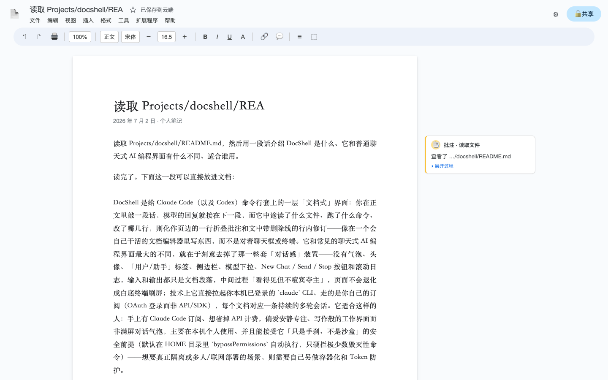

# DocShell

> 给 **Claude Code CLI** 套一层「文档式」界面。你打一段字，模型的回复就是下一段正文，它中间做的事（读文件、跑命令、改代码）以**页边批注**和**修订记录**的形式呈现——像在用文档编辑器，而不是聊天窗口或终端。

[English README](./README.md)



---

## 为什么做这个

大多数 AI 编码前端长得像聊天应用或终端：气泡、头像、「user / assistant」标签、模型选择器、Send/Stop 按钮、不断滚动的日志。DocShell 走另一条路——一个**安静的、文档形状的界面**：

- **你的输入**就是文档正文里的一段。
- **模型的回复**是下一段正文。
- **工具调用和中间过程**变成**页边批注**（一行摘要，可展开看细节）和**正文里的修订记录**（文件改动以删除线 + 新增呈现）。

中间过程「可见但不喧宾夺主」——你能看到 agent 读了什么、跑了什么、改了什么，但页面不会变成一个白底的终端日志。

## 功能

- **文档式界面**——没有聊天气泡、头像、角色标签、侧边栏、模型选择器，也没有 New Chat / Send / Stop 按钮。输入和输出都是文档段落。
- **过程可见**——工具调用落在右侧页边、成为可折叠批注（「读取 2 个文件」「运行 ls」…）；文件编辑渲染成正文里的修订。
- **真正的 Claude Code 后端、用你的订阅**——spawn 本地 `claude` CLI、走它的 OAuth 登录（你的 Claude Code 订阅），**不是** API/SDK。目前只实现了 Claude Code 后端。
- **干净的多轮**——每个文档一个常驻 `claude --input-format stream-json` 进程，跨轮上下文连续；服务器重启后用 `--resume` 恢复。
- **多文档**——新建 / 切换文档，每个是独立对话、本地持久化（IndexedDB）。刷新即开新对话，旧文档仍在「文件」菜单里。
- **边等边输入（排队）**——回复还在生成时也能继续打字，补充的消息排队、自动接力发出。
- **Esc 中断**——生成中途停下（文档里没有 Ctrl-C，用 Esc 代替）。
- **危险命令手刹**——`PreToolUse` hook 硬拦灾难性 Bash（删根/家/系统目录的 `rm`、`mkfs`、`dd` 写块设备、fork 炸弹、`shred`）。它是**手刹，不是沙箱**（见[安全](#安全)）。
- **网络部署的 token 认证**——非 loopback 绑定要求至少 32 字符的共享 token，既能从私有网络里的另一台设备访问，也不会把 agent API 裸露出来。

## 工作原理

```
浏览器（文档界面）                  服务端（Next.js，你的机器）
┌───────────────────────┐         ┌─────────────────────────────────┐
│  正文段（输入/输出）   │◄──SSE──►│  /api/chat                       │
│  页边批注             │         │   └─ lib/cc-process.ts           │
│  IndexedDB（文档）    │         │       每文档常驻进程             │──► claude (stream-json)
└───────────────────────┘         │       lib/stream-parser.ts       │
                                   │       lib/tool-comment.ts        │
                                   └─────────────────────────────────┘
```

- **`lib/cc-process.ts`** 为每个文档维持一个常驻 `claude --input-format stream-json` 进程，每轮把消息以结构化形式通过 stdin 喂进去。这样多轮记忆天然连续，并避开 `--resume` 注入的「Continue from where you left off」合成回合。服务器重启后用 `--resume <sessionId>` 恢复某文档的上下文（并吞掉那个合成恢复回合）。
- **`lib/stream-parser.ts`** 把 CLI 的 `stream-json` 解析成 chunk（文本增量、tool_use、tool_result、result、错误）。
- **`lib/tool-comment.ts`** 把工具调用塑形成页边批注 / 修订。
- 前端（`app/page.tsx`）把这一切渲染成文档，回复经 SSE 流式接收。

## 快速开始（本地）

前置：

- Node.js 20+
- 已安装并登录的 [Claude Code CLI](https://docs.anthropic.com/en/docs/claude-code)（`claude` 在你的 `PATH` 里）

```bash
npm install
npm run dev   # http://127.0.0.1:3000
```

受守卫保护的启动器会绑定 `127.0.0.1`，因此不需要 token（仅本机可访问）。打开页面开始打字即可。直接执行 `npx next ...` 不会产生本机模式所需的启动证明；未设置 token 时，API 会有意拒绝这类启动方式。

## 生产 / 网络部署

`scripts/start-prod.sh` 和 `scripts/run-server.sh` 默认绑定 `127.0.0.1`。要从私有网络里的另一台设备访问，必须显式要求网络绑定，**同时设置 token**。所有受支持的启动器在「非 loopback 地址 + 无 token」时都会拒绝启动：

```bash
npm run token:init
DOCSHELL_HOST=0.0.0.0 PORT=3010 bash scripts/start-prod.sh
```

然后用 `http://<server-ip>:<port>/#token=<你的token>` 打开一次；之后 token 会存进浏览器。只接受 URL **fragment**（`#` 后面）的 token，浏览器不会把它发给服务器，所以不会进访问日志；有意不再兼容会进入服务器日志的 `?token=` 查询参数。

在 macOS 上，请通过**跑在 GUI 会话里的 launchd LaunchAgent**（`scripts/run-server.sh`）启动，而不是裸的 SSH / 后台进程——否则 `claude` CLI 读不到登录会话 Keychain 里的订阅凭证，会报 `Not logged in`。

## 配置

| 环境变量 | 默认 | 含义 |
|---|---|---|
| `DOCSHELL_TOKEN` | _(未设)_ | 设了之后，每个 API 请求都必须带匹配的 `x-docshell-token` 头。绑定任何非 loopback 地址时都必须设置至少 32 字符的值。 |
| `DOCSHELL_HOST` | `127.0.0.1` | 绑定地址。无 token 时只接受字面量 `127.0.0.1` 或 `::1`。 |
| `PORT` | `3010`（生产） | 服务端口。 |
| `DOCSHELL_NO_REMOTE_CONTROL` | _(未设)_ | 设为 `1` 可关闭对 spawn 出的会话开启 Claude Remote Control。 |

当前后端是 Claude Code，模型固定为 `opus`。精细度可在文档设置里选择（标准 / 深度 / 快速 → `high` / `max` / `low`），默认是 `max`。

## 安全

DocShell 以 `--permission-mode bypassPermissions`（工具自动执行）+ 危险命令护栏运行。**这是手刹，不是沙箱：**

- 护栏只拦一小撮直白、不可逆的命令；可被混淆写法绕过（base64 管道进 shell、子解释器等）。
- 工作目录默认是用户的 `HOME`。
- 服务端专用的 `DOCSHELL_*` 认证与绑定变量会从 Claude 子进程环境中移除；但 agent 仍以同一个系统用户运行，仍能访问这个用户本来有权读取的文件。处理不可信内容时请使用独立账户或更强隔离。
- 上传临时文件放在当前用户拥有、权限为 `700` 的目录中，文件权限为 `600`，每轮结束后删除；若进程硬崩溃，仍可能留下临时文件。

任何超出「个人本地使用」的场景，请做真正的隔离（容器 / 受限账户 / 只读挂载 / 限定 cwd），并在服务可经网络访问时始终设置 `DOCSHELL_TOKEN`。token 放在自定义头中，可抵御浏览器跨站请求伪造。

无 token 模式下，Next.js Route Handler 拿不到可信的对端 socket 地址。因此 DocShell 只在共享启动守卫已经证明「这个服务进程绑定的是字面量 `127.0.0.1` 或 `::1` 上的指定端口」时放行；host / port 证明缺失或相互矛盾都会拒绝。严格同源校验仍保留为浏览器侧的额外 CSRF 防线，但不再被当作网络来源证明。

## 技术栈

Next.js · React · TypeScript · Server-Sent Events · IndexedDB · Claude Code CLI。

## 许可

MIT
